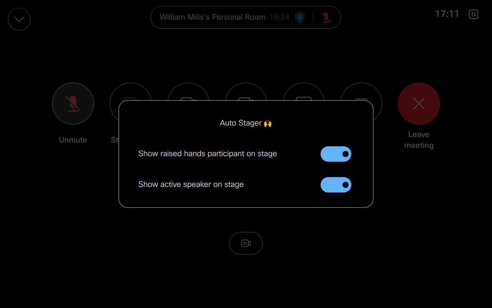

# Auto Stager Macro

This is an example macro which demonstrates how to automatically move participants in a Webex Meeting to the stage on a Cisco Collaboration Device




## Overview

This macro monitors the hand raised state for each participant while on a Webex Meeting from a Cisco Collaboration Device.

When a meeting participant raises or lowers their hand the macro will automatically add or remove them from the Devices local stage.

The macro also lets you ensure the Active Speaker is always visible when raised hand participants have been moved to stage.

Lastly, the macro saves an in-call UI Extension panel to provide controls for toggling on or off this macro .

## Setup

### Prerequisites & Dependencies: 

- RoomOS 11.24.x or above Webex Device.
- Web admin access to the device to upload the macro.


### Installation Steps:
1. Download the ``auto-stager.js`` file and upload it to your Webex Room devices Macro editor via the web interface.
2. Configure the Macro by changing the initial values, there are comments explaining each one.
      ```javascript
      const config = {
        button: {
          name: 'Auto Stager 🙌',   // Name of the Button and Panel Page
          icon: 'Sliders'           // One of the supported native icons name
        },
        panelText: {              // Raise Hand and Active Speaker Text
          handRaise: 'Show raised hands participant on stage',
          activeSpeaker: 'Show active speaker on stage'
        },
        panelId: 'autostager'     // PanelId is used for the base panel and widget Ids
      }
      ```
3. Enable the Macro on the editor.

## Demo

*For more demos & PoCs like this, check out our [Webex Labs site](https://collabtoolbox.cisco.com/webex-labs).


## License

All contents are licensed under the MIT license. Please see [license](LICENSE) for details.


## Disclaimer

Everything included is for demo and Proof of Concept purposes only. Use of the site is solely at your own risk. This site may contain links to third party content, which we do not warrant, endorse, or assume liability for. These demos are for Cisco Webex use cases, but are not Official Cisco Webex Branded demos.
Please contact the WXSD team at [wxsd@external.cisco.com](mailto:wxsd@external.cisco.com?subject=auto-stager-macro) for questions. Or, if you're a Cisco internal employee, reach out to us on the Webex App via our bot (globalexpert@webex.bot). In the "Engagement Type" field, choose the "API/SDK Proof of Concept Integration Development" option to make sure you reach our team. 


## Questions
Please contact the WXSD team at [wxsd@external.cisco.com](mailto:wxsd@external.cisco.com?subject=RepoName) for questions. Or, if you're a Cisco internal employee, reach out to us on the Webex App via our bot (globalexpert@webex.bot). In the "Engagement Type" field, choose the "API/SDK Proof of Concept Integration Development" option to make sure you reach our team. 
